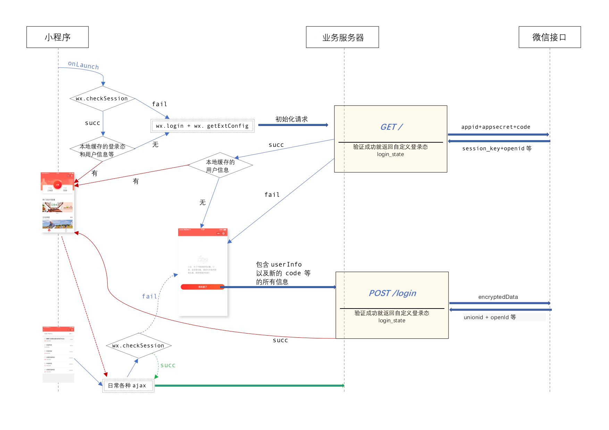

# 小程序开发启动包

*后端开发重点阅读 1、2 部分即可*

> 支持 less 、nodejs-mock-api 、本地语言包 等的微信小程序开发启动包

## 1. 目录结构

- `/public/` 目录为实际的提交发布目录（指的是提交微信审核，而不是只向git提交）
- `/api/` 目录中提供了用于演示数据的通信接口，用(expressjs)[http://expressjs.com/]编写
- `/assets/` 目录中存放调用服务器的素材图片等（并不提交给微信），其中不以下划线开头的图片为必须素材，后端应上传至服务器端
- `/src/` 目录为前端开发用到的源码，也并不需要提交给微信

## 2. 后端测试和审核发布

### 2.1 代码和调试

- 拉取本项目中的代码
- 修改 /public/project.config.json 中的 name 和 repository
- 用“微信web开发者工具”添加项目，填入 AppID，并将以上代码中的`public`目录设置为项目目录
- 进入项目后，将开发者工具“详情”选项中的“ES6转ES5”等所有选项都勾选
- 将`/public/app.config.js`中的协议、端口等改为自己的配置；! 注意：如果是前端开发时，修改`dev.config.js`，会自动生成覆盖前者的内容 !
- 前端尽量不要修改`dev.config.js`，特殊情况下改完后应恢复原状提交；需要指定 IP 等可用 2.4 中的做法
- 遍历public下的wxss文件，如果存在诸如 `https://localhost:7001` 这样开头(具体取决于 dev.config.js)的图片地址，也应该批量替换成对应地址
- 在开发者工具的“调试”中，可以pc端调试
- 在开发者工具的“项目”中，点击“预览”按钮后，会生成二维码，在手机端调试
- 提交审核前注意在服务器配置中设置响应头"Access-Control-Allow-Origin"为"https://servicewechat.com"，其他设置请详细阅览官方文档

### 2.2 前后端接口

> 所有 mock 数据放在 `/api/` 目录中，可以分为任意数量的 xxx.api.js 文件

所有 ajax 请求均以 `dev.config.js` 中的 mock_prefix 部分为前缀，以便区分；如：

```
GET /weappmini/index
```

所有 ajax 请求均须返回以下JSON格式（本文档用php格式说明，具体实现语言不限）:

    $response = array(
        "errcode"=> 0, //0为成功，其他整数为失败
        "errlevel"=> 'default', //若为 "alert"， 则弹出提示
        "errmsg"=> "hello world", //成功或失败的提示
        "result"=> array(...) //业务逻辑的返回值部分
    );
    $app->response()->header('Content-Type', 'application/json');
    echo json_encode($response);

其中每次请求，均会携带以下信息：

```
'_from_weapp' //总是为1，表示来自于小程序的请求
'login_state' //初始化请求中根据 wx.login 和 wx.getExtConfig 返回的自定义登录态
'encryptedData',
'rawData',
'iv',
'path',
'query',
'scene',
'signature',
'userInfo',
'code',
'extConfig'
```

### 2.3 常见 nodejs api

必备环境：

- 安装 nodejs
- 在项目根目录 `npm i`

场景1：前端在本机开发（localhost）

```
#拉取代码后重新编译less等，保证变量正确
npm run reset

#启动服务
npm start

#打开微信开发者工具...
```

场景2：真机调试或预览（用电脑自身的IP）

```
#将变量等替换成ip地址的格式
npm run reset -ip=1

#启动服务
npm start -ip=1

#打开微信开发者工具...
```

场景3：真机调试或预览（指定IP或域名）

```
#将变量等替换成指定的格式
npm run reset -ip=<YOUR_HOST>

#启动服务
npm start -ip=<YOUR_HOST>

#打开微信开发者工具...
```

### 2.4 登录验证流程



## 3. 前端开发

### 3.1 开发概述

- `/src/` 目录中只存放字体文件和less样式源码
- 字体文件会被自动编译为base64供wxss引用，一般不会添加
- less源码会被自动编译为对应的wxss文件，所以后者不能手动修改
- `/assets/`中的纯展示图片(实际运行中会被替换为实际图片的)，应以下划线开头；并且在 git add 时强制添加，比如命令行下就是加`-f`参数
- `/assets/`中的素材图片，如图标、背景图等，一般由设计师协助提供SVG格式

### 3.2 开发步骤

- 运行 `npm start`，以启动api服务器并自动监听less等
- 改变配置等之后，可能需要运行 `npm run reset` 重置一下
- 关于 `dev.config.js` 的配置可以阅读 2.2 中的部分
- 首先参考已有结构，新建或修改 api 目录下的文件，将所做功能的后台数据结构完成
- 返回数据中涉及的图标等素材图，存放到 assets 目录中
- tabbar等处的图标等，需要打包发布的，放到 public/images/ 中
- 在 public/app_requests.js 中，写好相应的请求方法以供页面 js 调用；! 不在页面 js 中直接写 `wx.request()` !
- 根据新的登录逻辑，上述文件中的请求方法应调用 _chkSessionAndRequest()
- 需要新建页面的，在开发者工具中修改 app.json 中的 pages 节点，开发者工具会自动生成对应文件
- 需要提取为可复用组件的部分，在 public/components 目录下建立相应自定义组件
- 在 src/less 目录下，建立和 public 中完全对应目录的 less 文件
- 注意 public/weui.wxss 为固定文件，不要手动更改或用 less 误重写
- 新建 less 文件中的引用等可参考已有文件
- less 文件中涉及的图片，先将对应图片放置到 assets 目录中，再在 less 中写入 url('@{img}/xxx.svg') 并保存，才能正确生成 wxss

### 3.3 本地语言包

页面中如果需要写入中文等，应先归纳到语言包文件 public/locale.js 中以供页面调用； 
不能在页面的 js 和 wxml 中直接写入

    ```javascript
    //locale.js
    {
        ...
        miaosha: {
            label_table: "桌",
            product_count: "¥{0} 每件，根据{1}年标准执行"
            ...
        }
    }
    ```

    ```javascript
    //页面js或组件js中
    const locale = getApp().globalData.locale.miaosha;
    ```

    ```xml
    <text>{{ locale.label_table }}</text>
    ``` 

### 3.4 报错和提示

- 默认的错误提示方式按 2.3 章节中的 'errcode'、'errlevel'、'errmsg' 逻辑
- 默认情况且 errlevel 为 'default' 的，可以在 result 中放入 `weapp_buttons`，其结构为 {label, type, route}
- 默认情况且 errlevel 为 'default' 的，可以在 result 中放入 `weapp_iconUrl`，实现图标自定义
- 默认情况且 errlevel 为 'alert' 的，可以在 result 中放入 routeAfterAlert，跳到指定的页面(可包含 ?foo=foo&bar=bar 部分)
- 各页面局部的、具体的业务错误，应该用 app_requests.js -> chkSessionAndRequest() 的第五个参数（错误处理回调）来自定义

app 实例里有两个方法可以调用：

```
//alert
app.alert(msg, okCallback);
```

```
//转入msg页面
app.showMessagePage(errcode, errmsg, [{label, type, route}], iconUrl);
```

## 4 涉及技术

- [微信小程序官方文档](https://mp.weixin.qq.com/debug/wxadoc/dev/)
- [weui-wxss](https://github.com/weui/weui-wxss/blob/master/README.md)
- [expressjs](http://expressjs.com/en/4x/api.html)
